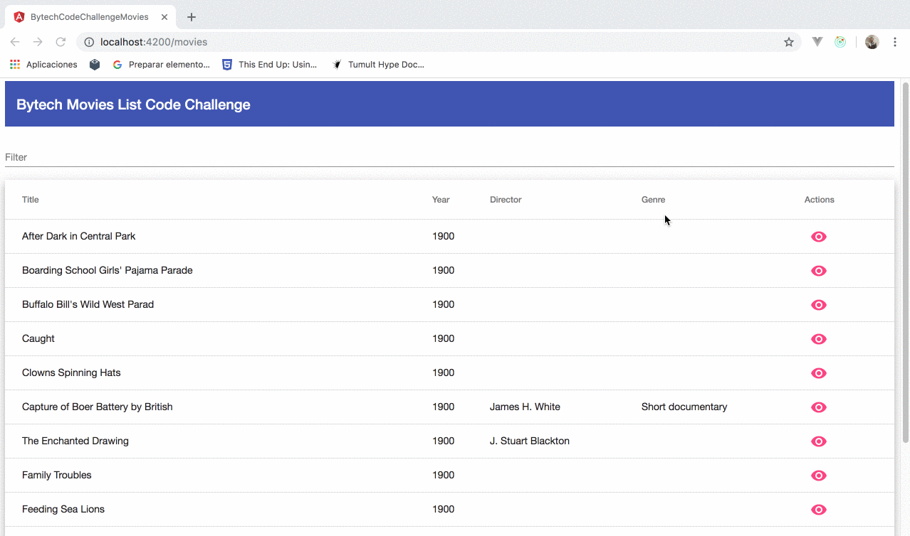

# BytechCodeChallengeMovies

Angular code challenge from Bytech company.

This project was generated with [Angular CLI](https://github.com/angular/angular-cli) version 8.2.0.

## Instructions

WebService is available for viewing movies. The WebService publishes two methods:

```bash
    It returns the information about the movie whose Id is id.

    GET http://host/publicData/film/:id
```

```bash
    Returns the n movie information in paginated mode via npage.

    GET http://host/publicData/films?page=:npage&records=:n
```

WebService data is invariable (not being maintained) and read-only.

Develop a SPA application based on Angular with the following features:

    - The application will consist of two pages.
        - List: it will allow to navigate the movies in a paginated way showing the main fields in a tabular format.
        - Detail: will allow you to see all the details of a specific movie.
        - The last X movies consulted will be cached in the browser in order to minimize the number of calls to the WebService.
        - All pages displayed must have a different URL so that the user can add in his browser the favorite links you want.

Make a skeleton of the indicated application, placing special emphasis on the structure of modules and Angular objects to be developed and the relationships between them. Encode the resulting objects so that you can see the main features you consider.

```bash
    Tabular format movies example

    Title ▲	Year	Director	Cast	Genre	Notes
    Movie 1	1900	someone	      -	    abcde	 -
    Movie 2	1950	someone	      -	    fghij    -	
    Movie 3	2000	someone	      -	    klmno    -	
```

## Used technologies

Technologies: Angular, Angular Material, Angular router, NGXS, TypeScript.

## App Example



## Start fake json movies server

```bash
    
    $ npm install -g json-server
    $ cd bytech-code-challenge-movies/json-server 
    $ json-server --watch db.json
```

### Routes

```bash

    * Returns all movies. Currently the endpoint returns more than 18000 movies.
    GET    /movies 
    Example http://localhost:3000/movies

    * Returns the limit movies information in paginated mode via page.
    GET /movies?_page=page&_limit=limit
    Example http://localhost:3000/movies?_page=1&_limit=1000

    * Returns the details of a movie whose id is id.
    GET    /movies/id
    Example: http://localhost:3000/movies/f576523c-fe61-441c-ab8d-4e443a3387d2
    
```

## Code Challenge Architecture

Probably the proposed architecture is not the perfect solution for all projects.

I have mainly followed the recommendations proposed by the Angular documentation.

This project is based on the following fundamentals:

    * Consistency: simplicity (for small apps) and scalability (for big apps).
    * Reusability in different projects.
    * Optimization (consistent with or without lazy-loading).
    * Testability.

    * app/
    *   |- app-routing.module.ts
    *   |- app-component.css
    *   |- app-component.html
    *   |- app-component.spec.ts
    *   |- app-component.ts
    *   |- app.module.ts
    *   |- ui/
    *       |- material/
    *           |- material.module.ts
    *   |- common/
    *       |- components/
    *           |- header/
    *               |- header.component.css
    *               |- header.component.html
    *               |- header.component.spec.ts
    *               |- header.component.ts
    *           |- footer/
    *               |- footer.component.css
    *               |- footer.component.html
    *               |- footer.component.spec.ts
    *               |- footer.component.ts
    *       |- shared-components.module.ts
    *   |- models/
    *       |- movie.model.ts
    *   |- pages/
    *       |- movie/
    *           |- movie.component.css
    *           |- movie.component.html
    *           |- movie.component.spec.ts
    *           |- movie.component.ts
    *           |- movie.module.ts
    *       |- movies/
    *           |- movies.component.css
    *           |- movies.component.html
    *           |- movies.component.spec.ts
    *           |- movies.component.ts
    *           |- movies.module.ts
    *   |- services/
    *       |- movies.services.spec.ts
    *       |- movies.services.ts

## Cached movies

In order to cache the movies and to improve application performance, the following options have been analyzed.

### Option 1: Use NGXS for state management (USED in code challenge)

NGXS is a state management pattern + library for Angular. It acts as a single source of truth for your application’s state, providing simple rules for predictable state mutations.

NGXS is modeled after the CQRS pattern popularly implemented in libraries like Redux and NGRX but reduces boilerplate by using modern TypeScript features such as classes and decorators.

NGRX is RxJS powered state management for Angular applications, inspired by Redux

Some of the advantages of using NGXS:

- Predictable state updates make it easier to understand how the data flow works in the application.
- Centralizing the state makes it easier to implement things like logging changes to the data, or persisting data between page refreshes.
- Simple: NGXS tries to make things as simple and accessible as possible. There can be a lot of boilerplate code in state management, thus a main goal of NGXS is to reduce boilerplate allowing you to do more things with less. It is also not necessary to be super familiar with RxJs.
- Dependency Injection (DI): A core feature of Angular is dependency injection. It can be a very useful tool and NGXS makes sure that users can use DI in their state management code. This means Angular services can be injected into state classes making it easier to take advantage of more Angular features.
- Action Life Cycles: Actions in NGXS are asynchronous. This allows actions to have a life cycle, meaning we can now listen for when a single action or a collection of actions is complete making complex workflows predictable. It is very common to want to do something after an action is completed and NGXS makes it simple to do.
- Promises: Observables are great but they aren't a silver bullet. Sometimes Promises are the preferred option. NGXS allows either to be returned from an action method.

When it comes to getting the movies, the action FETCH_MOVIES is triggered. 

If there are no movies in the state, the result obtained from the request is assigned.

If the action is triggered again the request is not made and the movies data is obtained from state.

```bash

store/actions/movies.actions.ts

export class FetchMovies {
    static readonly type = '[Movies] Fetch movies';

    constructor(public payload: {page: number, limit: number}) {}
}

export class ClearState {
    static readonly type = '[Movies] Clear state';
}

```

```bash

store/state/movies.state.ts

import { State, Action, StateContext, Selector, NgxsOnInit } from '@ngxs/store';
import { tap, catchError } from 'rxjs/operators';
import { throwError } from 'rxjs';
import { Movie } from '../../models/movie.model';
import { FetchMovies, ClearState } from './../actions/movies.actions';
import { MoviesService } from '../../services/movies.service';


export class MoviesStateModel {
    movies: Movie[];
}

@State<MoviesStateModel>({
    name: 'catalog',
    defaults: {
        movies: [],
    }
})

export class MoviesState implements NgxsOnInit {

    constructor(private moviesService: MoviesService) {}

    @Selector()
    static getMovies(state: MoviesStateModel) {
        return state.movies;
    }

    @Selector()
    static movieById(state: MoviesStateModel) {
        return (id: string) => {
            return state.movies.filter(movie => movie.id === id)[0];
        };
    }

    ngxsOnInit(ctx: StateContext<MoviesStateModel>) {
        console.log('State initialized.');
        ctx.dispatch(new ClearState());
    }

    @Action(ClearState)
    clearState({ setState }: StateContext<MoviesStateModel>) {
        setState({
            movies: [],
        });
    }

    @Action(FetchMovies, { cancelUncompleted: true })
    fetchMovies({ getState, setState }: StateContext<MoviesStateModel>, { payload }) {
        console.log('MovieState::fetchMovies() | method called', payload);
        const { page, limit } = payload;
        if (getState().movies.length === 0) {
            return this.moviesService.getMovies(page, limit).pipe(
                catchError((x, caught) => {
                    return throwError(x);
                }),
                tap((result) => {
                const state = getState();
                setState({
                    ...state,
                    movies: [ ...state.movies, ...result ]
                });
            },
            (error) => {
                console.log('error', error.message);
            }));
        }
    }

}

```

### Option 2: Use localStorage

Instead of making the same request every time, the view is loaded with the movie list checking whether if the list is already saved in the localStorage. If this is the case, it is directly retrieved, otherwise the request is made (it would be the first time) and stored in the localStorage.

```bash

    Example code

    let data = localStorage.getItem('movies');

    if (!data) {
      this.getMovies();
    }
    else {
        this.loadingMovies = false;
        this.movies = [...JSON.parse(data)];
    }
```

### Option 3: Makes request cacheable

Caching HTTP requests with Angular.

```bash

Example code

import { RequestCache } from './request-cache.service';

@Injectable()
export class CachingInterceptor implements HttpInterceptor {
  constructor(private cache: RequestCache) {}

  intercept(req: HttpRequest<any>, next: HttpHandler) {
    const cachedResponse = this.cache.get(req);
    return cachedResponse ? Observable.of(cachedResponse) : this.sendRequest(req, next, this.cache);
  }

  sendRequest(
    req: HttpRequest<any>,
    next: HttpHandler,
    cache: RequestCache): Observable<HttpEvent<any>> {
    return next.handle(req).pipe(
      tap(event => {
        if (event instanceof HttpResponse) {
          cache.put(req, event);
        }
      })
    );
  }
}

import { Injectable } from '@angular/core';
import { HttpRequest, HttpResponse } from '@angular/common/http';

const maxAge = 30000;
@Injectable()
export class RequestCache  {

  cache = new Map();

  get(req: HttpRequest<any>): HttpResponse<any> | undefined {
    const url = req.urlWithParams;
    const cached = this.cache.get(url);

    if (!cached) {
      return undefined;
    }

  const isExpired = cached.lastRead < (Date.now() - maxAge);
    const expired = isExpired ? 'expired ' : '';
    return cached.response;
  }

  put(req: HttpRequest<any>, response: HttpResponse<any>): void {
    const url = req.url;
    const entry = { url, response, lastRead: Date.now() };
    this.cache.set(url, entry);

    const expired = Date.now() - maxAge;
    this.cache.forEach(expiredEntry => {
      if (expiredEntry.lastRead < expired) {
        this.cache.delete(expiredEntry.url);
      }
    });
  }
}

```

## Extra points

The following extra points have been developed

    - NGXS has been used.
    - Added 3D card carousel movies. http://localhost:8080/#/carousel
    
    I used a web component that I developed using stenciljs. This web component can be used in any frontend framework or simply with vanillajs. This way we don't marry a specific framework and the development can be used in the future.

    Stencil is a compiler for building fast web apps using Web Components.

    Stencil combines the best concepts of the most popular frontend frameworks into a compile-time rather than run-time tool. Stencil takes TypeScript, JSX, a tiny virtual DOM layer, efficient one-way data binding, an asynchronous rendering pipeline (similar to React Fiber), and lazy-loading out of the box, and generates 100% standards-based Web Components that run in any browser supporting the Custom Elements v1 spec.

    [For more information](https://github.com/abritopach/st-3d-card-carousel). 

## Potential improvements

Some of the improvements that I thought could be made in the code challenge are:

    - Movies CRUD.
    - Generate reusable web components.
    - Improve design.
    - TDD, unit tests

## Development server

Run `ng serve` for a dev server. Navigate to `http://localhost:4200/`. The app will automatically reload if you change any of the source files.

## Code scaffolding

Run `ng generate component component-name` to generate a new component. You can also use `ng generate directive|pipe|service|class|guard|interface|enum|module`.

## Build

Run `ng build` to build the project. The build artifacts will be stored in the `dist/` directory. Use the `--prod` flag for a production build.

## Running unit tests

Run `ng test` to execute the unit tests via [Karma](https://karma-runner.github.io).

## Running end-to-end tests

Run `ng e2e` to execute the end-to-end tests via [Protractor](http://www.protractortest.org/).

## Further help

To get more help on the Angular CLI use `ng help` or go check out the [Angular CLI README](https://github.com/angular/angular-cli/blob/master/README.md).
